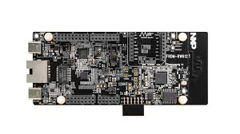
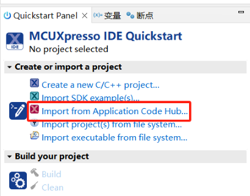
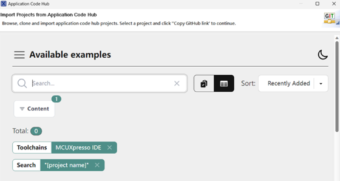
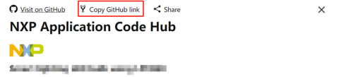
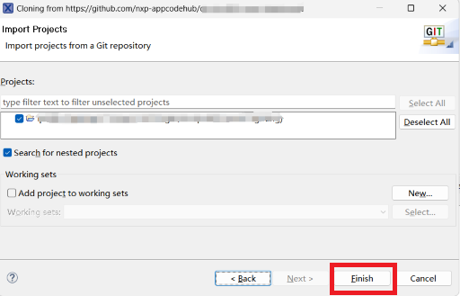
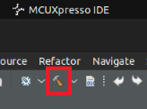
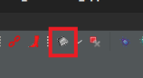

# NXP Application Code Hub

##  FreeRTOS-Based LittleFS Support on SPI-NAND (W25N01GV) for FRDM-RW612

This project showcases LittleFS-based persistent storage on SPI-NAND (W25N01GV) using the FRDM-RW612 board under FreeRTOS. It supports reliable file create, read, write, delete, and large-file operations using a DHARA Flash Translation Layer (FTL) for wear leveling and power-loss recovery.The firmware is configured by default for the W25N01GV device. Support for other SPI-NAND devices can be added by updating the corresponding device parameters (JEDEC ID, page and block geometry, command set, and timing values) in the configuration structures.

#### Boards: FRDM-RW612
#### Categories: Memory, RTOS
#### Peripherals: FLASH, SPI
#### Toolchains: MCUXpresso IDE

## Table of Contents
1. [Software](#step1)
2. [Hardware](#step2)
3. [Setup](#step3)
4. [Results](#step4)
5. [FAQs](#step5) 
6. [Support](#step6)
7. [Release Notes](#step7)

## 1. Software
- [MCUXpresso 24.12 or newer](https://nxp.com/mcuxpresso)
- [SDK Version 25_09_00 for FRDM-RW612](https://mcuxpresso.nxp.com/en/select)

## 2. Hardware
- [FRDM-RW612]https://www.nxp.com/design/design-center/development-boards-and-designs/FRDM-RW612)  

## 3. Setup

### 3.1 Import Example
1. Open MCUXpresso IDE, in the Quick Start Panel, choose Import from Application Code Hub   

2. Enter the demo name in the search bar.

3. Click Copy GitHub link, MCUXpresso IDE will automatically retrieve project attributes, then click Next>.

4. Select main branch and then click Next>, Select the MCUXpresso project, click Finish button to complete import.

### 3.2 Build and flash
1. Connect a USB cable between the PC host and the MCU-Link port on the target board.

2. Open a serial terminal with the following settings:
    - 115200 baud rate
    - 8 data bits
    - No parity
    - One stop bit
    - No flow control 
3. Build the application.

 

4. Flash the program to the target board.

 

5. Press the reset button.

### 3.3 Running the demo

1. Replace U12 (PSRAM) on FRDM-RW612 with W25N01GV SPI NAND.
2. Upon power-up, Observe the UART debug logs to verify NAND initialization, LittleFS mount, and stress test execution.

## 4. Results
If the hardware connections and configuration are correct, the following logs will be printed on the console:

Sample Console Output:

Debug logs(for successful test scenario):

	W25N01GV JEDEC ID: EF AA 21

	SNAND: Target FRDM-RW612
	-------------------------------------
	[DHARA] init/resume OK
	-------------------------------------
	DHARA bring-up successful
	[LFS] Ready: 29698 blocks (59396 KB usable)
	[LFS] mount OK

	--- Starting LFS Stress Test ---
	Written 0 files...
	Written 10 files...
	Written 20 files...
	Written 30 files...
	Written 40 files...
	Verifying data...
	Verification successful!
	Deleting files to trigger Dhara recovery...
	--- Stress Test Passed! ---

	>>>> BOOT NUMBER: 2 <<<<
	
	--- NAND Performance Benchmark (512 KB) ---
    WRITE: 512 KB in 505 ms (1013 KB/s)
    READ : 512 KB in 1785 ms (286 KB/s)
    DELETE: Completed in 30 ms
	
Debug Logs(Content Mismatch Validation Scenario):

(This scenario is intentionally used to validate data verification and error-detection logic.)

	W25N01GV JEDEC ID: EF AA 21

	SNAND: Target FRDM-RW612
	-------------------------------------
	[DHARA] init/resume OK
	-------------------------------------
	DHARA bring-up successful
	[LFS] Ready: 29698 blocks (59396 KB usable)
	[LFS] mount OK

	--- Starting LFS Stress Test ---
	Written 0 files...
	Written 10 files...
	Written 20 files...
	Written 30 files...
	Written 40 files...
	Verifying data...
	DATA MISMATCH in file test_0.txt!
	Expected: Hello Dhara! This is data for file number 0
	Got:      Hello! This is data for file number 0

	>>>> BOOT NUMBER: 1 <<<<
    
	--- NAND Performance Benchmark (512 KB) ---
    WRITE: 512 KB in 505 ms (1013 KB/s)
    READ : 512 KB in 1785 ms (286 KB/s)
    DELETE: Completed in 30 ms

#### Project Metadata

<!----- Boards ----->

<!----- Categories ----->

<!----- Peripherals ----->

<!----- Toolchains ----->

Questions regarding the content/correctness of this example can be entered as Issues within this GitHub repository.

>**Warning**: For more general technical questions regarding NXP Microcontrollers and the difference in expected functionality, enter your questions on the [NXP Community Forum](https://community.nxp.com/)

## 7. Release Notes
| Version | Description / Update                           | Date                        |
|:-------:|------------------------------------------------|----------------------------:|
| 1.0     | Initial release on Application Code Hub        | April 02th 2026 |

<small>
<b>Trademarks and Service Marks</b>: There are a number of proprietary logos, service marks, trademarks, slogans and product designations ("Marks") found on this Site. By making the Marks available on this Site, NXP is not granting you a license to use them in any fashion. Access to this Site does not confer upon you any license to the Marks under any of NXP or any third party's intellectual property rights. While NXP encourages others to link to our URL, no NXP trademark or service mark may be used as a hyperlink without NXP’s prior written permission. The following Marks are the property of NXP. This list is not comprehensive; the absence of a Mark from the list does not constitute a waiver of intellectual property rights established by NXP in a Mark.
</small>
 
<small>
NXP, the NXP logo, NXP SECURE CONNECTIONS FOR A SMARTER WORLD, Airfast, Altivec, ByLink, CodeWarrior, ColdFire, ColdFire+, CoolFlux, CoolFlux DSP, DESFire, EdgeLock, EdgeScale, EdgeVerse, elQ, Embrace, Freescale, GreenChip, HITAG, ICODE and I-CODE, Immersiv3D, I2C-bus logo , JCOP, Kinetis, Layerscape, MagniV, Mantis, MCCI, MIFARE, MIFARE Classic, MIFARE FleX, MIFARE4Mobile, MIFARE Plus, MIFARE Ultralight, MiGLO, MOBILEGT, NTAG, PEG, Plus X, POR, PowerQUICC, Processor Expert, QorIQ, QorIQ Qonverge, RoadLink wordmark and logo, SafeAssure, SafeAssure logo , SmartLX, SmartMX, StarCore, Symphony, Tower, TriMedia, Trimension, UCODE, VortiQa, Vybrid are trademarks of NXP B.V. All other product or service names are the property of their respective owners. © 2021 NXP B.V.
</small>
